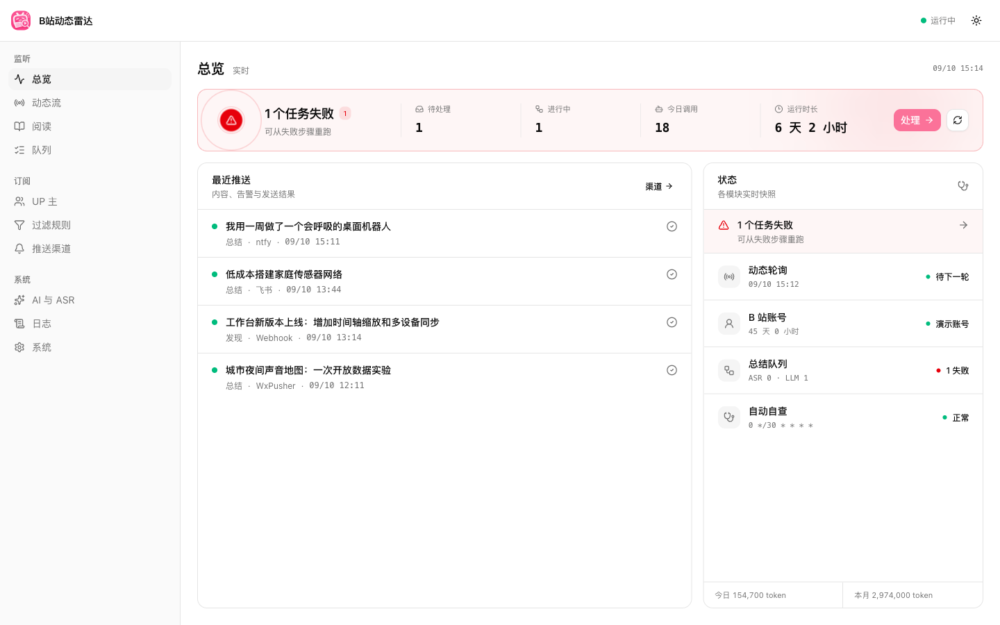
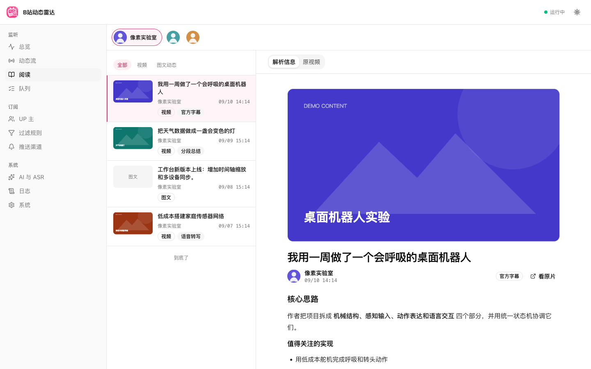
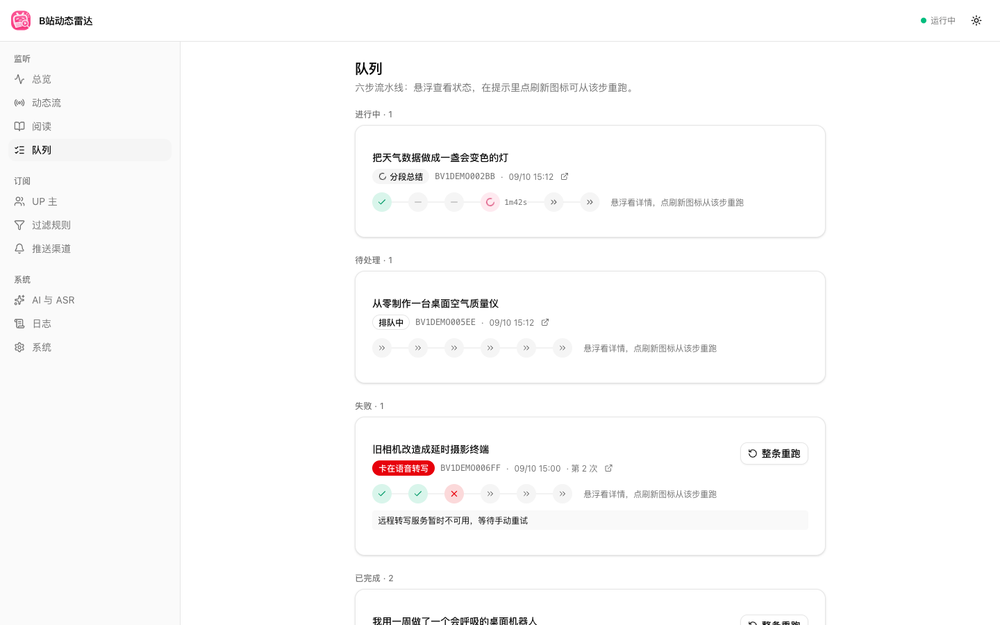

# B站动态雷达

单用户、自托管的 B 站动态监听与 AI 视频总结工作台。订阅指定 UP 主后，应用会轮询新动态、按规则过滤内容、提取字幕或转写音频、生成结构化总结，并推送到微信、ntfy、飞书或自定义 Webhook。

> 项目会调用 B 站 Web 接口，并可自动关注 UP 主。建议使用小号，谨慎调整轮询频率与写接口限额。



## 功能

- **动态监听**：按 UP 主订阅，增量拉取新动态，持久化锚点避免重复处理
- **历史阅读**：浏览本地动态或实时读取指定 UP 主空间流
- **AI 总结**：优先使用官方字幕，无字幕时下载音频并转写
- **任务流水线**：字幕、下载、转写、分段总结、合并、落盘六步可观测并可分步重跑
- **内容过滤**：支持全局与每 UP 主黑白名单、正则规则、免扰时段
- **多渠道推送**：WxPusher、PushPlus、ntfy、飞书和 Webhook
- **故障自查**：检查登录态、轮询、转写和推送状态，提供实时日志
- **本地持久化**：SQLite 保存配置和业务数据，敏感信息使用 AES-256-GCM 加密

<table>
  <tr>
    <td></td>
    <td></td>
  </tr>
</table>

## 快速开始

### 本地运行

需要 Node.js 24、pnpm 10，以及用于无字幕视频的 `yt-dlp` 和 `ffmpeg`。macOS 本地转写使用 `mlx_audio`；也可以在页面中配置远程 OpenAI 兼容 ASR。

```bash
nvm use
corepack enable
pnpm install
cp .env.example .env
pnpm dev
```

打开 <http://127.0.0.1:5173>。首次启动后按页面提示扫码登录 B 站，再到「AI 与 ASR」及「推送渠道」填写所需配置。

生产模式由同一个 Node.js 进程提供 API 和前端静态文件：

```bash
pnpm build
pnpm start
# http://127.0.0.1:8788
```

### Docker Compose

容器已包含 `yt-dlp` 和 `ffmpeg`。先创建 `.env`，设置一个至少 16 个字符的主密钥：

```dotenv
MASTER_KEY=replace-with-a-long-random-secret
```

启动：

```bash
docker compose up -d --build
docker compose logs -f bili-video
```

打开 <http://127.0.0.1:8788>。`compose.yaml` 只将端口绑定到宿主机回环地址，运行数据保存在 `bili-video-data` volume。

容器没有 Apple Metal 环境，因此不支持本地 `mlx-audio`。首次容器启动会切换到 `openai-compat`，请在「AI 与 ASR」页面配置远程转写服务；也可以改用 `chat-audio`。

### 使用 GHCR 镜像

将 `<owner>/<repo>` 替换为 GitHub 仓库路径：

```bash
docker pull ghcr.io/<owner>/<repo>:latest

docker run -d \
  --name bili-video \
  --restart unless-stopped \
  -p 127.0.0.1:8788:8788 \
  -e MASTER_KEY='replace-with-a-long-random-secret' \
  -v bili-video-data:/app/data \
  ghcr.io/<owner>/<repo>:latest
```

## 数据与安全

### 主密钥

`data/master.key` 或 `MASTER_KEY` 是所有 cookies、SESSDATA 和 API Key 的根密钥。**主密钥丢失后，数据库内的加密内容无法恢复。**

- 本地默认生成 `data/master.key`，请单独备份，不要提交到 Git
- Docker 推荐通过 `MASTER_KEY` 注入，并保存在密码管理器或部署平台 Secret 中
- 已有数据库不可随意更换主密钥，否则需要清空加密数据并重新登录、重新填写 API Key

### 持久化目录

`DATA_DIR` 默认为 `./data`，包含：

```text
data/
├── app.db          # 配置与业务数据
├── master.key      # 本地模式主密钥
├── audio/          # 转写过程中的音频
├── summaries/      # Markdown 总结
└── logs/           # 轮转日志
```

至少备份 `app.db` 和主密钥。复制 SQLite 数据库前应先停止应用，或使用系统页提供的数据导出能力。

### 网络边界

应用没有登录系统。本地模式默认监听 `127.0.0.1`，Docker 虽在容器内监听 `0.0.0.0`，Compose 和示例命令仍只暴露到宿主机 `127.0.0.1`。不要直接将 8788 端口暴露到公网；如需远程访问，请在反向代理层增加 HTTPS 和身份认证。

## 配置

配置以 SQLite 的 `app_config` 为唯一真相。首次启动会写入内置默认值，之后在工作台修改并即时生效。环境变量只负责进程启动所需参数：

| 变量 | 默认值 | 说明 |
| --- | --- | --- |
| `DATA_DIR` | `./data` | 数据目录 |
| `WEB_ROOT` | `./dist/web` | 前端构建产物目录 |
| `MASTER_KEY_PATH` | `$DATA_DIR/master.key` | 本地主密钥文件路径 |
| `MASTER_KEY` | 空 | 主密钥口令，设置后优先于文件，至少 16 字符 |
| `SERVER_HOST` | 数据库配置 | 仅覆盖本次进程的监听地址 |
| `SERVER_PORT` | 数据库配置 | 仅覆盖本次进程的监听端口 |
| `LOG_JSON` | 空 | 设为 `1` 时输出 JSON 日志 |
| `BILI_VIDEO_DOCKER` | 自动检测 | 设为 `1` 时启用容器运行约束 |

应用内主要配置包括：轮询周期、B 站签名常量、过滤规则、AI/ASR 服务、总结并发、输出目录、推送渠道和健康检查。

## 镜像发布

`.github/workflows/container.yml` 使用 GitHub Actions 构建 `linux/amd64` 与 `linux/arm64` 镜像并推送到 GHCR：

- 推送到 `main`：发布 `latest` 与 `sha-<commit>`
- 推送 `v*` 标签：发布标签、语义化版本与 commit SHA，例如 `v1.2.3`、`1.2.3`、`1.2`

工作流使用仓库自带的 `GITHUB_TOKEN`，无需额外配置镜像仓库密码。仓库需允许 Actions 写入 Packages；首次发布后可在 GitHub Packages 页面调整镜像可见性。

发布示例：

```bash
git tag v0.1.0
git push origin v0.1.0
```

## 开发

```bash
pnpm dev            # 后端 8788 + Vite 5173
pnpm typecheck      # shared/server/web 三份 TypeScript 配置
pnpm test           # node:test 测试套件
pnpm build          # 后端声明检查 + Vite 生产构建
```

项目结构：

```text
src/shared/contract/   前后端共享 schema 与类型
src/server/
  domain/              无 IO 的业务规则
  app/                 登录、轮询、队列、推送等用例编排
  infra/               SQLite、B 站、AI、ASR、通知等适配器
  http/                Hono API、静态资源与 SSE
  server.ts            依赖组合与服务生命周期
src/web/               React + Vite + Tailwind CSS 工作台
test/                  真 SQLite + 假外部 I/O 的测试
```

详细行为与设计取舍见 [`docs/spec/v1-bili-monitor-summary.md`](docs/spec/v1-bili-monitor-summary.md)。
